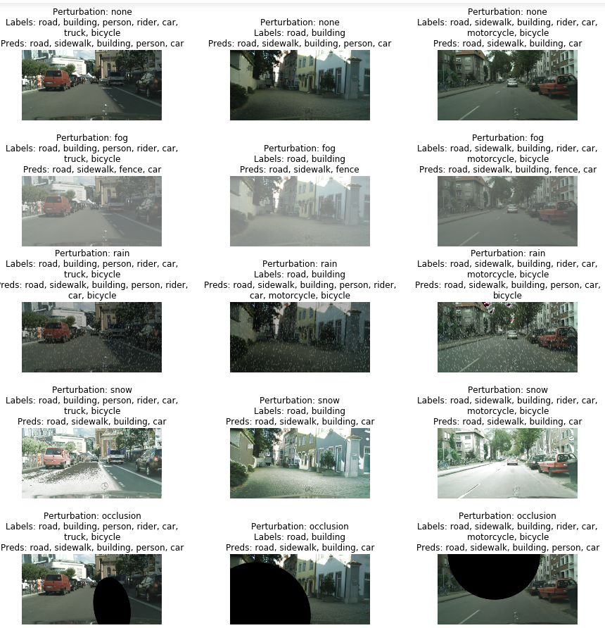

# CNNs vs Weather
Examining the effects of simulated perturbations such as rain, snow, fog and occlusions on the most popular CNN models

<p align="center">A few examples!<br>
  
</p>

## About
This repo allows you to easily train and test a few of the most popular convolutional neural network architectures on the [Cityscapes](https://www.cityscapes-dataset.com/dataset-overview/) dataset, modified to simulate naturally ocurring weather conditions and other perturbations.

## Usage
### Installation
Install dependencies
- PyTorch (https://pytorch.org/get-started/locally/)
- OpenCV
- Numpy
- Matplotlib
- Scipy 
- PIL

Clone this repo:  
```git clone https://github.com/danielzgsilva/CNNs_vs_Weather```  
```cd CNNs_vs_Weather```

Download the Cityscapes dataset: https://www.cityscapes-dataset.com/downloads/

You will need the following zip files
- leftImg8bit_trainvaltest.zip
- leftImg8bit_trainextra.zip
- disparity_trainvaltest.zip
- disparity_trainextra.zip
- gtFine_trainvaltest.zip
- gtCoarse.zip 

Finally, unzip these into a folder names cityscapes. You may use a different folder but you'll need to specify the data directory during training or testing. The default data folder is:  
```~/path/to/CNNs_vs_Weather/cityscapes/```

### Train a model
To train a model, run the train.py file while passing your desired training parameters. Note that this repo currently supports the training of ResNet34, VGG16, and Inception v3 networks for multi-label classification on the Cityscapes dataset

To train a pretrained ResNet34 model for Cityscapes classification:  
```python train.py --model_type resnet --model_name resnet_test --pretrained True --num_epochs 5```

To train a ResNet34 model from scratch:  
```python train.py --model_type resnet --model_name resnet_test --pretrained False --freeze False --num_epochs 5```

To finetune a pretrained ResNet34 model:  
```python train.py --model_type resnet --model_name resnet_test --pretrained True --finetune True --num_epochs 5```

By default, model weights are saved in a 'models' directory as a tar ball with the --model_name you passed  
```~/path/to/CNNs_vs_Weather/models/resnet_test.tar```

For a complete list of possible training parameters run:  
```python train.py --help```

### Test


### Visualizing synthetic weather and model predictions


## Citations
[The Cityscapes Dataset for Semantic Urban Scene Understanding](https://arxiv.org/abs/1604.01685)

[On the Susceptibility of Deep Neural Networks to Natural Perturbations](https://www.osti.gov/biblio/1557474)

